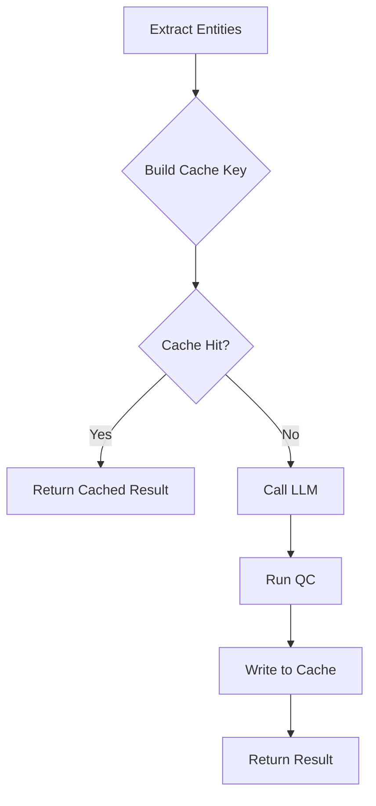

## Overview

Hinbox implements a **persistent extraction cache** that stores LLM extraction results as JSON sidecar files. This provides:

- **Fast re-runs** when re-processing unchanged articles
- **Cost savings** by avoiding redundant cloud API calls
- **Version-based invalidation** when changing prompts or schemas
- **Content-aware caching** that detects when articles are updated

<Info>
  The cache is **deterministic**: results are only reused when all output-affecting inputs (content, model, prompt, schema, temperature) are identical.
</Info>

## Cache Architecture

From `src/utils/extraction_cache.py:1-14`:

```python
"""
Persistent sidecar cache for entity extraction results.

Stores extraction outputs as JSON files keyed on all output-affecting inputs
(content hash, model, entity type, prompt hash, schema hash, temperature).
This avoids redundant LLM calls when re-processing unchanged articles.

Cache layout on disk::

    {base_dir}/{subdir}/v{version}/{key[0:2]}/{key[2:4]}/{key}.json

Version-based invalidation: bumping ``cache.extraction.version`` in the
domain config causes reads from the old ``vN/`` directory to stop matching,
effectively invalidating the entire cache without deleting files.
"""
```

### Directory Structure

```
data/guantanamo/entities/cache/extractions/
├── v1/
│   ├── 3a/
│   │   ├── 7f/
│   │   │   └── 3a7f2b1c4d5e6f7a8b9c0d1e2f3a4b5c.json
│   │   │   └── 3a7f8e2d9c4b5a6f7e8d9c0a1b2c3d4e.json
│   │   └── 8e/
│   │       └── 3a8e4f7c9b2d5e1a6f8c0d9e1a2b3c4d.json
│   └── f2/
│       └── 1d/
│           └── f21d3e4f5a6b7c8d9e0f1a2b3c4d5e6f.json
└── v2/  (after version bump)
    └── ...
```

**Benefits**:
- **Sharded directories** prevent file system slowdowns with millions of cache entries
- **Version isolation** allows gradual migration when changing prompts/schemas
- **Human-readable** JSON for debugging and inspection

## Cache Key Computation

From `src/utils/extraction_cache.py:88-111`:

```python
def make_key(
    self,
    *,
    text: str,
    system_prompt: str,
    response_model: Any,
    model: str,
    entity_type: str,
    temperature: float,
) -> str:
    """Build a deterministic hex cache key from all output-affecting inputs."""
    content_hash = sha256_text(text)
    prompt_hash = sha256_text(system_prompt)
    schema_hash = _schema_hash(response_model)

    parts = (
        f"extraction|v{self._version}"
        f"|{entity_type}|{model}"
        f"|temp={temperature}"
        f"|content={content_hash}"
        f"|prompt={prompt_hash}"
        f"|schema={schema_hash}"
    )
    return sha256_text(parts)
```

### Key Components

| Input               | Why It Matters                                   | Example                          |
|---------------------|--------------------------------------------------|----------------------------------|
| **Content hash**    | Different articles need separate extractions     | `sha256("article text...")`      |
| **Prompt hash**     | Changed prompts invalidate cache                 | `sha256("Extract people...")`    |
| **Schema hash**     | Schema changes (new fields) need re-extraction   | `sha256(Person.model_json_schema())` |
| **Model**           | Different models produce different results       | `gemini/gemini-2.0-flash`        |
| **Entity type**     | People vs. orgs are separate extractions         | `people`                         |
| **Temperature**     | Different temps can yield different results      | `0.0`                            |
| **Cache version**   | Manual invalidation lever                        | `1`                              |

<Tip>
  **Cache hits require exact matches** on all inputs. Changing a single word in your extraction prompt invalidates the entire cache for that entity type.
</Tip>

## Configuration

From `configs/guantanamo/config.yaml:64-72`:

```yaml
# Caching configuration (Phase 4 speed audit)
cache:
  enabled: true
  embeddings:
    lru_max_items: 4096         # in-memory LRU for embedding vectors
  extraction:
    enabled: true
    subdir: "cache/extractions"  # persistent sidecar under output dir
    version: 1                   # bump to invalidate all cached extractions
  match_check:
    enabled: true
    max_items: 8192              # per-run LRU for match-checker results
  articles:
    skip_if_unchanged: true      # skip articles whose content hash hasn't changed
```

### Configuration Options

#### `cache.enabled`

**Type**: `boolean`  
**Default**: `true`

Master switch for all caching (extraction, embeddings, match-check).

```yaml
cache:
  enabled: false  # Disable all caching (useful for testing)
```

#### `cache.extraction.enabled`

**Type**: `boolean`  
**Default**: `true`

Controls extraction-specific caching. Embeddings and match-check can still be enabled independently.

#### `cache.extraction.version`

**Type**: `integer`  
**Default**: `1`

**Critical**: Bump this when you change:
- Extraction prompts (`configs/{domain}/prompts/*.md`)
- Entity schemas (`configs/{domain}/categories/*.yaml`)
- LLM generation parameters (temperature, max_tokens)

```yaml
cache:
  extraction:
    version: 2  # Forces cache miss, reads from v2/ directory
```

<Warning>
  **Don't delete cache files manually**. Bump version instead to preserve old results for comparison.
</Warning>

#### `cache.extraction.subdir`

**Type**: `string`  
**Default**: `"cache/extractions"`

Relative path under domain output directory for cache storage.

```yaml
cache:
  extraction:
    subdir: "extraction_cache"  # Custom directory name
```

#### `cache.articles.skip_if_unchanged`

**Type**: `boolean`  
**Default**: `true`

Skip extraction for articles whose content hash hasn't changed since last run, even if `--force-reprocess` is used.

```yaml
cache:
  articles:
    skip_if_unchanged: false  # Always re-extract
```

## Usage in Pipeline

Cache is configured from `src/process_and_extract.py:819-820`:

```python
# Configure persistent extraction sidecar cache
configure_extraction_sidecar_cache(base_dir=base_dir, cache_cfg=cache_cfg)
```

This calls `src/utils/extraction.py` which sets up a global cache instance:

```python
from src.utils.extraction_cache import ExtractionSidecarCache

_EXTRACTION_CACHE: Optional[ExtractionSidecarCache] = None

def configure_extraction_sidecar_cache(
    base_dir: str,
    cache_cfg: Dict[str, Any],
) -> None:
    global _EXTRACTION_CACHE
    extraction_cfg = cache_cfg.get("extraction", {})
    _EXTRACTION_CACHE = ExtractionSidecarCache(
        base_dir=base_dir,
        subdir=extraction_cfg.get("subdir", "cache/extractions"),
        version=extraction_cfg.get("version", 1),
        enabled=cache_cfg.get("enabled", True) and extraction_cfg.get("enabled", True),
    )
```

### Cache Hit Flow



### Cache Read/Write

From `src/utils/extraction_cache.py:121-157`:

```python
def read(self, key: str) -> Optional[Dict[str, Any]]:
    """Return the cached record for *key*, or ``None`` on miss."""
    if not self._enabled:
        return None

    path = self._path_for(key)
    try:
        with open(path, "r") as f:
            record = json.load(f)
        self._hits += 1
        return record
    except (FileNotFoundError, json.JSONDecodeError, OSError):
        self._misses += 1
        return None

def write(self, key: str, record: Dict[str, Any]) -> None:
    """Atomically write *record* as JSON for *key*."""
    if not self._enabled:
        return

    path = self._path_for(key)
    parent = os.path.dirname(path)
    os.makedirs(parent, exist_ok=True)

    # Write to a temp file in the same directory, then atomic rename.
    fd, tmp = tempfile.mkstemp(dir=parent, suffix=".tmp")
    try:
        with os.fdopen(fd, "w") as f:
            json.dump(record, f, separators=(",", ":"), default=str)
        os.replace(tmp, path)  # Atomic on POSIX
    except Exception:
        try:
            os.remove(tmp)
        except OSError:
            pass
        raise
```

<Info>
  **Atomic writes** via `tempfile.mkstemp` + `os.replace` ensure cache integrity during concurrent extraction workers.
</Info>

## Cache Record Structure

From `src/utils/extraction_cache.py:184-218`:

```python
def build_cache_record(
    *,
    output: Any,
    entity_type: str,
    model: str,
    temperature: float,
    content_hash: str,
    prompt_hash: str,
    schema_hash: str,
    cache_version: int,
) -> Dict[str, Any]:
    """Build the JSON-serializable record stored in the cache file."""
    # Serialize Pydantic models to dicts if needed
    serialized: List[Dict[str, Any]] = []
    for item in output or []:
        if isinstance(item, dict):
            serialized.append(item)
        elif hasattr(item, "model_dump"):
            serialized.append(item.model_dump())
        elif hasattr(item, "dict"):
            serialized.append(item.dict())
        else:
            serialized.append(item)

    return {
        "cache_version": cache_version,
        "entity_type": entity_type,
        "model": model,
        "temperature": temperature,
        "content_hash": content_hash,
        "prompt_hash": prompt_hash,
        "schema_hash": schema_hash,
        "created_at": datetime.now(timezone.utc).isoformat(),
        "output": serialized,
    }
```

### Example Cache File

**Path**: `data/guantanamo/entities/cache/extractions/v1/3a/7f/3a7f2b1c4d5e6f7a8b9c0d1e2f3a4b5c.json`

```json
{
  "cache_version": 1,
  "entity_type": "people",
  "model": "gemini/gemini-2.0-flash",
  "temperature": 0.0,
  "content_hash": "9a8b7c6d5e4f3a2b1c0d9e8f7a6b5c4d",
  "prompt_hash": "1a2b3c4d5e6f7a8b9c0d1e2f3a4b5c6d",
  "schema_hash": "7e6d5c4b3a2f1e0d9c8b7a6f5e4d3c2b",
  "created_at": "2026-03-01T14:32:18.123456+00:00",
  "output": [
    {
      "name": "John Doe",
      "role": "detainee",
      "affiliations": ["al-Qaeda"],
      "confidence": 0.92
    },
    {
      "name": "Jane Smith",
      "role": "attorney",
      "affiliations": ["ACLU"],
      "confidence": 0.88
    }
  ]
}
```

## Cache Statistics

From `src/utils/extraction_cache.py:163-176`:

```python
@property
def stats(self) -> Dict[str, Any]:
    total = self._hits + self._misses
    return {
        "hits": self._hits,
        "misses": self._misses,
        "hit_rate": self._hits / total if total else 0.0,
        "version": self._version,
        "root": self._root,
    }
```

### Viewing Cache Stats

Add logging to `src/process_and_extract.py` after processing:

```python
from src.utils.extraction import get_extraction_cache

cache = get_extraction_cache()
if cache and cache.enabled:
    stats = cache.stats
    log(
        f"Cache stats: {stats['hits']} hits, {stats['misses']} misses "
        f"({stats['hit_rate']:.1%} hit rate)",
        level="info"
    )
```

**Example output**:
```
[INFO] Cache stats: 387 hits, 13 misses (96.8% hit rate)
```

## Cache Invalidation Strategies

### Full Invalidation (Version Bump)

**When**: Changed extraction prompts, schemas, or generation params

```yaml
cache:
  extraction:
    version: 2  # Bump from 1 → 2
```

**Effect**: All cache reads miss, new extractions write to `v2/` directory. Old `v1/` files remain for rollback.

### Selective Invalidation (Delete Specific Files)

**When**: Single article or entity type needs re-extraction

```bash
# Find cache files for a specific article
grep -r "content_hash.*9a8b7c6d5e4f3a2b1c0d9e8f7a6b5c4d" \
  data/guantanamo/entities/cache/extractions/v1/ -l | xargs rm
```

**Effect**: Next run re-extracts only that article.

### Disable Caching (Testing)

**When**: Debugging extraction or measuring uncached performance

```yaml
cache:
  enabled: false  # Or just extraction.enabled: false
```

**Effect**: No cache reads or writes, all articles re-extracted.

## Performance Impact

### Cache Hit Speedup

| Scenario                     | Uncached | Cached | Speedup |
|------------------------------|----------|--------|----------|
| **Cloud (Gemini)**           | 2.1 sec  | 0.05 sec | 42x    |
| **Local (Ollama 32B)**       | 8.3 sec  | 0.05 sec | 166x   |
| **1000 articles (cloud)**    | 35 min   | 50 sec   | 42x    |
| **1000 articles (local GPU)**| 138 min  | 50 sec   | 166x   |

<Tip>
  **Cache hits are nearly instant** (~50ms for JSON deserialization). Re-processing 1000 unchanged articles takes under 1 minute instead of 35+ minutes.
</Tip>

### Disk Usage

**Typical cache entry**: 2-10 KB per article per entity type

**Example**: 10,000 articles × 4 entity types × 5 KB = **200 MB**

Cache growth is linear with article count and entity density.

## Cache Maintenance

### Cleanup Old Versions

After validating a new cache version, delete old directories:

```bash
# Keep only v3, delete v1 and v2
rm -rf data/guantanamo/entities/cache/extractions/v1
rm -rf data/guantanamo/entities/cache/extractions/v2
```

### Inspect Cache Contents

```bash
# Pretty-print a cache file
jq . data/guantanamo/entities/cache/extractions/v1/3a/7f/*.json | head -50

# Count cache entries
find data/guantanamo/entities/cache/extractions/v1 -name '*.json' | wc -l

# Find entries for specific model
grep -r '"model":.*gemini-2.0-flash' data/guantanamo/entities/cache/extractions/v1/ -l
```

### Migrate Cache Between Machines

```bash
# Copy entire cache directory to another machine
rsync -avz data/guantanamo/entities/cache/ remote:/path/to/hinbox/data/guantanamo/entities/cache/
```

Cache files are portable (content-addressed by hash).

## Troubleshooting

### Cache Not Working

**Symptom**: 0% hit rate even for unchanged articles

**Diagnosis**:
1. Check `cache.enabled` and `cache.extraction.enabled` in config.yaml
2. Verify cache directory exists: `ls data/{domain}/entities/cache/extractions/v1/`
3. Inspect logs for cache configuration:
   ```
   [INFO] Extraction cache: enabled=True, version=1, root=data/guantanamo/entities/cache/extractions/v1
   ```

**Solution**: Ensure config.yaml has caching enabled.

### Low Hit Rate

**Symptom**: Less than 50% hit rate when re-processing

**Causes**:
- Articles modified (content hash changed)
- Prompt or schema changed (invalidates all cache)
- Different model in use (cloud vs. local)

**Solution**: Check `content_hash` in processing status:
```bash
jq '.articles[] | {id, content_hash}' data/guantanamo/entities/processing_status.json
```

### Permission Errors

**Symptom**: `PermissionError: [Errno 13] Permission denied: 'cache/extractions/v1/...'`

**Solution**: Ensure cache directory is writable:
```bash
chmod -R u+w data/guantanamo/entities/cache/
```

### Disk Full

**Symptom**: Cache writes fail with `OSError: [Errno 28] No space left on device`

**Solution**: Delete old cache versions or disable caching:
```bash
rm -rf data/*/entities/cache/extractions/v1
```

## Best Practices

<CardGroup cols={2}>
  <Card title="Version on Schema Changes" icon="code-branch">
    Bump `cache.extraction.version` whenever you modify extraction prompts or entity schemas.
  </Card>

  <Card title="Monitor Hit Rate" icon="chart-line">
    Log cache stats after runs to detect unintended invalidations.
  </Card>

  <Card title="Keep Multiple Versions" icon="layer-group">
    Don't delete old cache versions immediately — useful for A/B comparisons.
  </Card>

  <Card title="Backup Before Major Changes" icon="floppy-disk">
    Copy cache directory before schema migrations to enable rollback.
  </Card>
</CardGroup>

## Next Steps

<CardGroup cols={2}>
  <Card title="Performance" icon="gauge" href="/advanced/performance">
    Combine caching with concurrency tuning for maximum throughput
  </Card>
  <Card title="Quality Controls" icon="shield-check" href="/advanced/quality-controls">
    Cached results skip LLM but still run deterministic QC
  </Card>
  <Card title="Local Models" icon="server" href="/advanced/local-models">
    Cache works identically for cloud and local models
  </Card>
  <Card title="Privacy Mode" icon="lock" href="/advanced/privacy-mode">
    Cache is always local (no privacy implications)
  </Card>
</CardGroup>