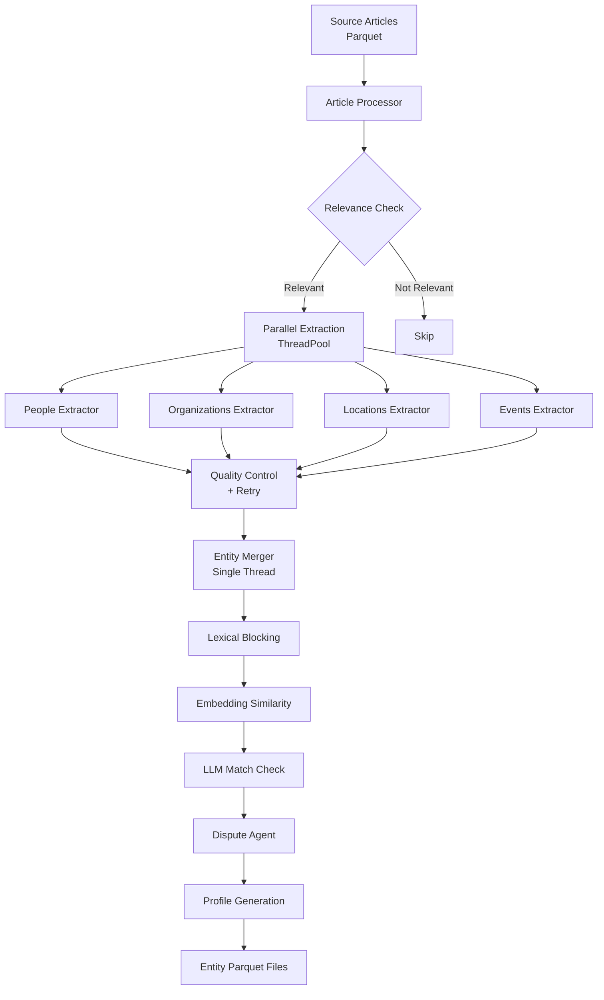

Hinbox implements a sophisticated multi-stage pipeline for extracting, deduplicating, and merging entities from historical source documents. The architecture is designed for both accuracy and performance, using a producer-consumer model with parallel extraction and serial merging.

## Core Design Principles

The system is built on three foundational principles:

<CardGroup cols={3}>
  <Card title="Evidence-First" icon="magnifying-glass">
    Cheap checks (lexical blocking, embeddings) run before expensive LLM calls
  </Card>
  <Card title="Producer-Consumer" icon="arrows-split-up-and-left">
    Parallel extraction workers feed a single merge actor to avoid race conditions
  </Card>
  <Card title="Sidecar Files" icon="database">
    Processing status and caches use separate JSON files instead of mutating source data
  </Card>
</CardGroup>

## High-Level Architecture



## Pipeline Components

### 1. Article Processor

The `ArticleProcessor` class orchestrates article-level operations across the pipeline.

**Location**: `src/engine/article_processor.py:52`

**Key responsibilities**:
- Domain-aware relevance checking
- Per-entity-type extraction orchestration  
- Quality control and retry logic
- Progress metadata aggregation

<CodeGroup>
```python Example: Extraction with QC Retry
# From src/engine/article_processor.py:153
def extract_single_entity_type(
    self,
    entity_type: str,
    article_content: str,
    article_id: str = "",
) -> PhaseOutcome:
    """Extract a single entity type, run QC, optionally retry once."""
    
    # Attempt 1
    raw_dicts = self._run_extraction(extractor, article_content)
    cleaned, qc_report = run_extraction_qc(
        entity_type=entity_type,
        entities=raw_dicts,
        domain=self.domain,
    )
    
    # Conditional retry on severe QC flags
    if _should_retry_extraction(qc_report.flags):
        hint = _build_repair_hint(entity_type, qc_report.flags)
        raw_dicts_v2 = self._run_extraction(
            extractor, article_content, repair_hint=hint
        )
        # Use better result...
```
</CodeGroup>

### 2. Producer-Consumer Pipeline

The pipeline uses a **ThreadPoolExecutor** for parallel extraction while maintaining a single-threaded merge actor to eliminate race conditions.

**Location**: `src/process_and_extract.py:667`

<Steps>
  <Step title="Submit extraction work to thread pool">
    Multiple articles are processed in parallel (configured via `extract_workers`). Within each article, the 4 entity types can also extract concurrently (`extract_per_article`).
  </Step>
  
  <Step title="Consume results in article order">
    The main thread waits for each future in submission order, ensuring deterministic merge behavior.
  </Step>
  
  <Step title="Merge entities (single writer)">
    Only the main thread writes to the shared `entities` dict and `ProcessingStatus` sidecar—no locking needed.
  </Step>
</Steps>

<CodeGroup>
```python Producer-Consumer Pattern
# From src/process_and_extract.py:732
with ThreadPoolExecutor(max_workers=extract_workers) as pool:
    futures = [
        pool.submit(
            extract_single_article_only,
            row,
            row_index,
            processor,
            args,
            status_snapshot=status_snapshot,
            skip_if_unchanged=skip_if_unchanged,
            extract_per_article=extract_per_article,
        )
        for row_index, row in enumerate(active_rows, 1)
    ]
    
    # Consume in submission (article) order
    for future in futures:
        result = future.result()
        processed_rows.append(result.row)
        
        merge_and_finalize(
            result,
            entities=entities,
            processor=processor,
            # ... single-threaded merge
        )
```
</CodeGroup>

<Info>
**Concurrency configuration** is set per domain in `configs/<domain>/config.yaml`:

```yaml
performance:
  concurrency:
    extract_workers: 8        # parallel articles
    extract_per_article: 4    # parallel entity types within article
    llm_in_flight: 16         # max concurrent cloud LLM calls
    ollama_in_flight: 2       # max concurrent local LLM calls
```
</Info>

### 3. Entity Merger (Evidence-First)

The `EntityMerger` implements a **cheap-to-expensive** cascade to minimize LLM costs while maintaining high accuracy.

**Location**: `src/engine/mergers.py:110`

<Accordion title="Merge Decision Cascade">
  <Steps>
    <Step title="Exact key match">
      If the entity key (name, or name+type tuple) already exists, merge immediately.
    </Step>
    
    <Step title="Lexical blocking (RapidFuzz)">
      Fast string similarity (threshold: 60/100) narrows candidates to ~50 entities.
    </Step>
    
    <Step title="Embedding similarity">
      Cosine similarity on evidence text embeddings (threshold: 0.75-0.82 depending on entity type).
    </Step>
    
    <Step title="LLM match check (temperature=0)">
      Deterministic yes/no/uncertain decision from the language model.
    </Step>
    
    <Step title="Dispute agent (gray band)">
      When match checker returns "uncertain" or confidence is in the gray band (0.60-0.75), a second LLM arbitrates.
    </Step>
  </Steps>
</Accordion>

### 4. Sidecar Caching System

To avoid mutating source Parquet files repeatedly, Hinbox uses **sidecar JSON files** for processing state and extraction caches.

<CardGroup cols={2}>
  <Card title="Processing Status">
    `data/<domain>/entities/processing_status.json` tracks which articles have been processed and their content hashes for skip-if-unchanged detection.
  </Card>
  
  <Card title="Extraction Cache">
    `data/<domain>/entities/cache/extractions/<hash>.json` stores extraction results keyed by content hash, model, prompt, schema, and temperature.
  </Card>
</CardGroup>

**Location**: `src/utils/processing_status.py`, `src/utils/extraction_cache.py`

<Note>
The extraction cache version is controlled in domain config:

```yaml
cache:
  extraction:
    enabled: true
    version: 1  # bump to invalidate all cached extractions
```
</Note>

## Module Organization

Hinbox's codebase is organized by responsibility:

```
src/
├── engine/                      # Core pipeline modules
│   ├── article_processor.py     # Relevance → extraction → QC orchestration
│   ├── extractors.py            # Unified cloud/local entity extraction
│   ├── mergers.py               # Evidence-first merge pipeline
│   ├── match_checker.py         # LLM-based match verification
│   ├── merge_dispute_agent.py   # Second-stage arbitration
│   ├── profiles.py              # Versioned profile management
│   └── relevance.py             # Domain-specific relevance filtering
├── utils/                       # Shared utilities
│   ├── embeddings/              # Embedding manager, similarity helpers
│   ├── extraction_cache.py      # Persistent sidecar cache
│   ├── processing_status.py     # Article processing tracker
│   ├── quality_controls.py      # Extraction/profile QC and grounding
│   └── name_variants.py         # Canonical name scoring, equivalence
├── process_and_extract.py       # CLI pipeline entry point
├── config_loader.py             # Domain configuration loader
└── frontend/                    # FastHTML web UI
```

## Privacy Mode

When `--local` flag is used, Hinbox enforces complete privacy:

<Steps>
  <Step title="Force local embeddings">
    Sets `EMBEDDING_MODE=local` to prevent cloud embedding calls.
  </Step>
  
  <Step title="Disable telemetry">
    Disables all LiteLLM callbacks so no data leaves the machine.
  </Step>
  
  <Step title="Use Ollama">
    All LLM calls go to local Ollama models instead of cloud APIs.
  </Step>
</Steps>

**Location**: `src/process_and_extract.py:786`

```python
if args.local:
    disable_llm_callbacks()
    os.environ["EMBEDDING_MODE"] = "local"
    reset_embedding_manager_cache()
    ensure_local_embeddings_available()
    log(
        "Privacy mode: embeddings + callbacks forced LOCAL (--local flag)",
        level="info",
    )
```

## Next Steps

<CardGroup cols={2}>
  <Card title="Processing Pipeline" icon="diagram-project" href="/concepts/pipeline">
    Learn about the 5 stages: relevance → extraction → QC → merging → profiles
  </Card>
  
  <Card title="Entity Types" icon="shapes" href="/concepts/entities">
    Understand entity structure and how types are defined per domain
  </Card>
  
  <Card title="Domain Configuration" icon="gear" href="/concepts/domains">
    Configure thresholds, prompts, and entity categories for your research domain
  </Card>
  
  <Card title="API Reference" icon="code" href="/api-reference/introduction">
    Explore the programmatic API for custom integrations
  </Card>
</CardGroup>